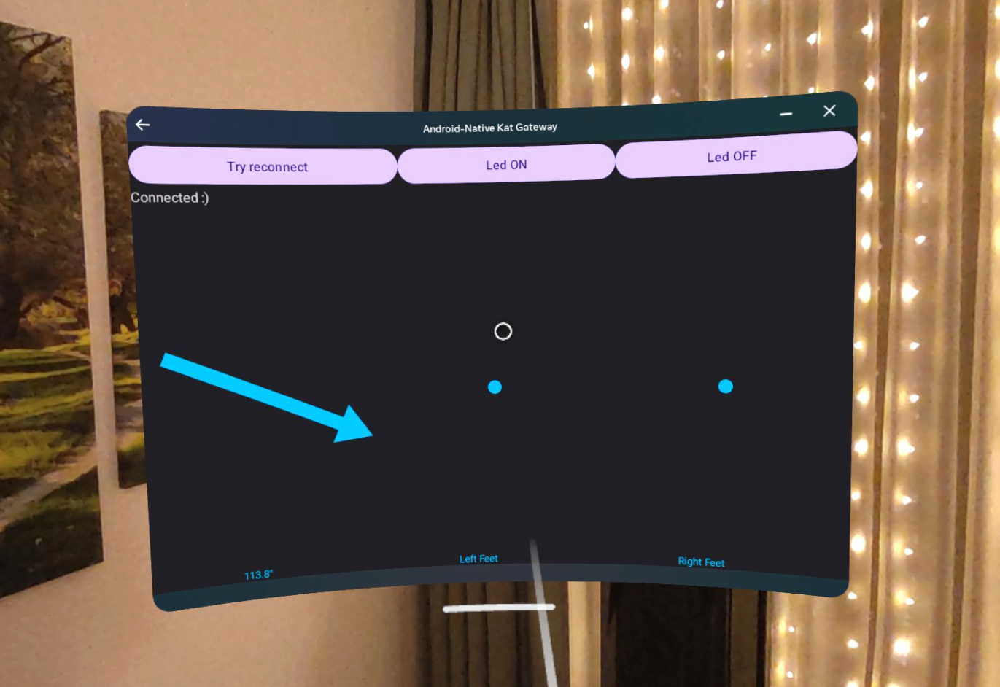

# Android-Native KAT Gateaway

Proof-of-concept code to implement communication with KAT Walk C2 treadmill without any
external service dependency.

Read about it in KatWalk C2 Saga, EP2: "to speak alien" on [Habr], [Medium] and [LinkedIn].

Tested on Android 14 phone and Quest 3 running Android 12L.

[Habr]: https://habr.com/ru/articles/799197/
[Medium]: https://medium.com/@datacompboy/katwalk-c2-part-2-peeking-eavesdropping-sniffing-and-learning-how-to-communicate-with-unknown-bb390c089a00
[LinkedIn]: https://www.linkedin.com/pulse/katwalk-c2-part-2-peeking-eavesdropping-sniffing-learning-fedorov-bcbme
